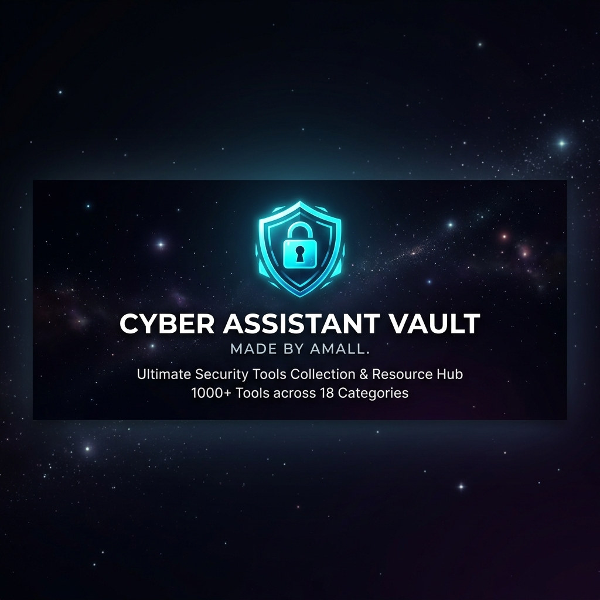

<p align="center">
  
</p>

<p align="center">
  <a href="https://www.amall.site/tools">
    
  </a>
  
  
  
</p>

---

## 🌐 Instant Web Access

Access the full Cyber Assistant Vault instantly in your browser:

👉 **[https://www.amall.site/tools](https://www.amall.site/tools)**

* 🔑 **1-Step Gmail Login**: Simply log in with your Gmail account to get full access.
* 🪟 **All-In-One Window**: Access **1000+ curated cybersecurity, admin & developer tools** in one streamlined interface.

---

## 💻 Download & Install as Desktop Software on PC

Run Cyber Assistant Vault directly on your Windows PC like a standalone software app.

### 🔑 Key Feature: **One-Time Login Only**
Once installed, you only log in **ONCE** with your Gmail account. The app saves your login session safely on your PC, so you never have to log in again!

---

### 📥 Step-by-Step Installation Guide

#### Option 1: 1-Click Desktop Shortcut Script (Fastest)

1. **Download the Repository**
   - Click the green **`Code`** button at the top right of this GitHub page.
   - Click **`Download ZIP`** and extract the ZIP file on your PC.

2. **Run the Installer**
   - Open the extracted folder.
   - Right-click `Install-CyberVault.ps1` and select **`Run with PowerShell`** (or double-click `CyberAssistantVault.bat`).

3. **Launch from Desktop**
   - A **Cyber Assistant Vault** shortcut icon will appear on your Desktop.
   - Double-click the desktop icon to open Cyber Vault as standalone PC software!

---

#### Option 2: Install via Browser PWA

1. Open **[https://www.amall.site/tools](https://www.amall.site/tools)** in **Google Chrome** or **Microsoft Edge**.
2. Log in **ONCE** with your Gmail account.
3. Click the **Install Icon** in the top-right corner of your browser's address bar (or click **Menu `⋮`** -> **Save and Share** -> **Install Cyber Assistant Vault**).
4. Click **Install**. A desktop app shortcut will be created automatically.

---

## 🚀 Key Features

* 🛡️ **1000+ Tools across 18 Categories**: Active Directory, Reverse Engineering, Forensics, OSINT, Cloud Security, System Admin, Pentesting, and Web Dev.
* ⚡ **One-Time Session Persistence**: Saves your session locally so you never enter passwords again.
* 🖥️ **Clean Standalone Window**: Custom app interface without browser tabs or address bar clutter.
* 🌙 **Sleek Dark Cyber Design**: Futuristic aesthetic with search filtering and fast category navigation.

---

## 🔒 Copyright & Legal License Notice

```text
Copyright (c) 2026 AMALL. All Rights Reserved.

Strict Proprietary License:
Viewing the repository source code on GitHub is permitted for reference purposes only.
Unauthorized copying, modification, redistribution, sub-licensing, re-publishing,
or commercial use of any part of this code is strictly prohibited without explicit
written permission from AMALL.
```

---

<p align="center">
  <b>Developed by AMALL</b><br>
  🌐 <a href="https://www.amall.site/tools">www.amall.site/tools</a>
</p>
